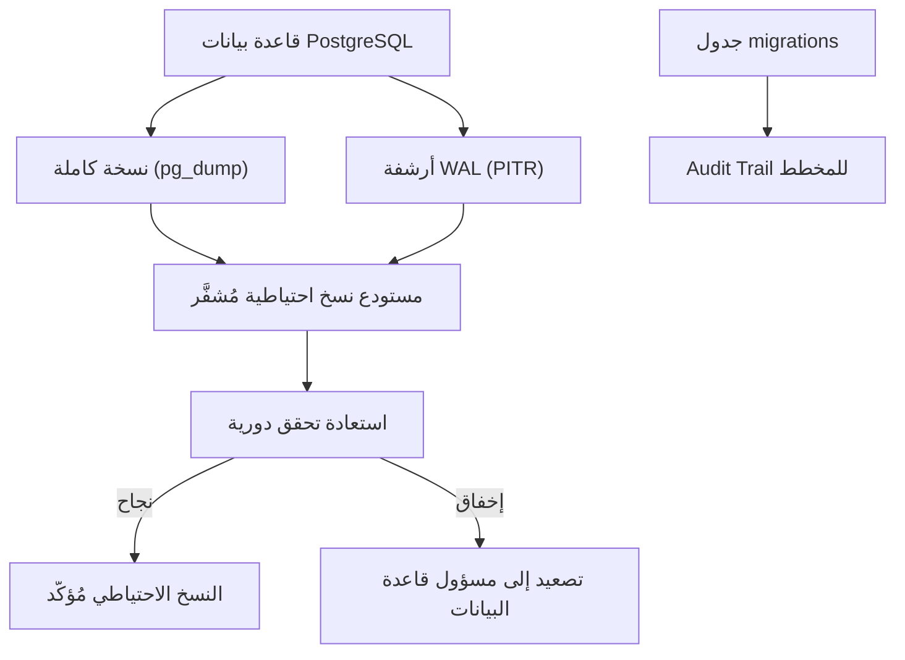

# سياسات النسخ الاحتياطي واستعادة قاعدة البيانات

## الغرض

يُحدّد هذا الدليل سياسات وإجراءات النسخ الاحتياطي لقاعدة البيانات، والاستعادة في لحظة زمنية محددة (PITR)، وإدارة إصدارات المخطط في accore ERP. يُوجَّه إلى مسؤولي قواعد البيانات (DBAs) ومهندسي DevOps المسؤولين عن استمرارية البيانات. نظراً لأن accore ERP يُطبّق الثبات المالي (Financial Immutability) في General Ledger (دفتر الأستاذ العام)، فإن سلامة المستودع الدائم تمثّل اهتماماً مؤسسياً بالغ الأهمية.

## النطاق والتطبيق

تشمل هذه السياسة قاعدة بيانات PostgreSQL الرئيسية لـ accore ERP، بما في ذلك جميع المخططات التي أنشأتها 142 ملف migration (هجرة) مُدار في `backend/database/migrations/`. تشمل جميع البيئات: الإنتاج والتجريبية والتطوير.

## الإجراء

**إدارة إصدارات المخطط**

1. يجب التعبير عن جميع تغييرات المخطط كملفات migration مُرقَّمة في `backend/database/migrations/`. يُحظر تعديل المخطط مباشرةً بـ SQL خارج منظومة migration.
2. قبل تنفيذ أي migration في الإنتاج، يتحقق مسؤول قاعدة البيانات من وجود نسخة احتياطية مُتحقَّق منها خلال نافذة الصيانة الحالية.
3. تُطبَّق migrations باستخدام `php artisan migrate --force` من مجلد الواجهة الخلفية. يُسجّل جدول `migrations` في PostgreSQL اسم وحزمة كل migration مُطبَّق، مما يُوفّر Audit Trail (سجل تدقيق) للمخطط.
4. تراجع migrations (`php artisan migrate:rollback`) متاح لبيئات التطوير والتجريب فقط. في الإنتاج، يُسمح بالتراجع بموافقة صريحة من مسؤول قاعدة البيانات فحسب.

**تنفيذ النسخ الاحتياطي** <!-- [ASSUMPTION] -->

5. تُجدوَل نسخ احتياطية منطقية كاملة لقاعدة بيانات PostgreSQL بـ `pg_dump` مع خيار `--format=custom` لإتاحة الاستعادة الانتقائية.
6. تُخزَّن النسخ الاحتياطية في موقع مُشفَّر خارج الخادم مع فترة احتفاظ لا تقل عن 30 يوماً.
7. يُفعَّل استرداد في لحظة زمنية (PITR) عبر أرشفة WAL (سجل الكتابة المسبقة) لدعم أهداف الاسترداد الدقيقة. <!-- [ASSUMPTION] -->

## المراقبة والتحقق

- تُتحقَّق من حالة اكتمال وظيفة النسخ الاحتياطي مقابل بيان مستودع النسخ بعد كل تشغيل مجدوَل.
- تُنفَّذ استعادة اختبار شهرياً لبيئة غير إنتاجية للتحقق من قابلية الاسترداد. <!-- [ASSUMPTION] -->
- يُستعلَم جدول `migrations` بعد كل نشر لتأكيد وجود جميع حزم migration المتوقعة.
- تشذّذ حجم ملف النسخة الاحتياطي (انحراف يتجاوز 20٪ من المتوسط المتحرك) يُشغّل تنبيهاً للتحقيق.

## استرداد الإخفاق

1. عند إخفاق وظيفة النسخ الاحتياطي، يُخطَر مسؤول قاعدة البيانات فوراً ويُسجَّل الإخفاق في سجل الحوادث التشغيلية.
2. عند اكتشاف تلف في المخطط، تُستعاد قاعدة البيانات من أحدث نسخة احتياطية مُتحقَّق منها، ثم تُطبَّق PITR لتضييق نافذة فقد البيانات.
3. عند إخفاق migration يترك المخطط في حالة مُطبَّقة جزئياً، ينفّذ مسؤول قاعدة البيانات `php artisan migrate:status` لتحديد migration الفاشلة ومعالجتها.
4. يُوثَّق الحادث بالسبب الجذري وإجراء الاسترداد والوقت المستغرق لأغراض التدقيق.

## الامتثال والتدقيق

- يستلزم الثبات المالي ألا تخضع جداول General Ledger لحذف مجمّع أو truncation خارج حدث تعافٍ مُستند رسمياً.
- تُسجَّل جميع أنشطة النسخ الاحتياطي والاستعادة في سجل حوادث العمليات، مما يُوفّر أدلةً للتدقيق SOC 2 Type II.
- يوفر سجل migration تاريخياً قابلاً للتحقق بأن جميع التغييرات الهيكلية طُبِّقت عبر العملية الخاضعة للضبط.

## سجل التغييرات

| التاريخ | التغيير | المؤلف |
|---------|---------|--------|
| 2026-03-26 | الإنشاء الأولي — تنفيذ المرحلة الرابعة (ترجمة عربية) | AI (L10N-002) |

## الافتراضات والأسئلة المفتوحة

<!-- [ASSUMPTION] --> جدولة النسخ الاحتياطي وأرشفة WAL مُهيَّأة على مستوى البنية التحتية؛ لا توجد أدوات نسخ احتياطي صريحة في ملفات المستودع المرصودة.
<!-- [ASSUMPTION] --> تستهدف استعادة التحقق الشهرية بيئةً غير إنتاجية مُعدَّة لذلك الغرض؛ لا تُعرَّف هذه البيئة في تهيئة المستودع المرصودة.
