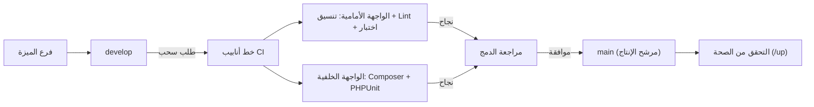

# استراتيجية النشر

## الغرض

يُحدّد هذا الدليل التشغيلي استراتيجية النشر لـ accore ERP، مغطياً خط تكامل مستمر (CI Pipeline)، ونموذج ترقية الفروع، وضوابط الإصدار. يُوجَّه إلى مهندسي DevOps ومديري الإصدارات والمهندسين المسؤولين عن ترقية تغييرات الكود عبر دورة حياة التطوير والإنتاج. يُرسي هذا المستند طبولوجيا خط الأنابيب الرسمية والتوقعات السلوكية لكل بوابة آلية.

## النطاق والتطبيق

يشمل هذا المستند جميع مكونات accore ERP: الواجهة الخلفية بـ Laravel PHP (مجلد `backend/`) والواجهة الأمامية بـ Next.js (مجلد `frontend/`). يحكم عمليات النشر عبر جميع البيئات التي يُرقَّى فيها الكود من فرع الميزة حتى الإصدار الإنتاجي. يلتزم جميع المستخدمين الذين يمتلكون حق الكتابة في المستودع بنموذج ترقية الفروع المُحدَّد هنا.

## الإجراء

يُدار خط أنابيب النشر بواسطة GitHub Actions ويتبع نموذج ترقية فرعَين.

1. **طبولوجيا الفروع**: `develop` هو فرع التكامل للأعمال الجارية. `main` هو الفرع الجاهز للإنتاج. يُحظر الإدراج المباشر في `main`؛ تصله جميع التغييرات عبر طلب سحب (Pull Request) من `develop`.
2. **بوابات الجودة الآلية عند الدفع/الطلب**: عند كل دفع أو طلب سحب يستهدف `develop` أو `main`، ينفّذ خط أنابيب CI وظيفتين متوازيتين:
   - **وظيفة جودة الواجهة الأمامية (`lint.yml`)**: تثبيت التبعيات، وتشغيل تنسيق الكود بـ Prettier، وتنفيذ ESLint، وتشغيل مجموعة اختبارات الواجهة الأمامية بـ Vitest.
   - **وظيفة اختبار الواجهة الخلفية (`tests.yml`)**: تهيئة خدمة MySQL 8.0، وتثبيت تبعيات PHP 8.2 بـ Composer، وتوليد مفتاح التطبيق، وتنفيذ جميع اختبارات PHPUnit عبر `php artisan test`.
3. **تطبيق البوابة**: يجب عدم دمج طلب السحب لـ `main` إذا أبلغت أي وظيفة CI عن رمز إنهاء غير صفري.
4. **ترقية الإصدار**: بعد اجتياز جميع البوابات وموافقة مراجع مُفوَّض واحد على الأقل، يُشكّل الدمج في `main` مرشح الإصدار الإنتاجي.
5. **التحقق بعد الدمج**: يتحقق مهندس الإصدار من أن نقاط نهاية فحص صحة التطبيق (`/up` في الواجهة الخلفية) تستجيب بـ HTTP 200. <!-- [ASSUMPTION] -->

## المراقبة والتحقق

- تظهر حالة وظائف CI في لسان تبويب GitHub Actions لكل إدراج وطلب سحب.
- نجاح وظيفة الواجهة الخلفية يؤكد تنفيذ جميع migrations (هجرات قاعدة البيانات) دون أخطاء.
- نجاح وظيفة الواجهة الأمامية يؤكد صحة أسلوب الكود والاختبارات.
- بعد النشر، تؤكد نقطة نهاية `/up` توفر الواجهة الخلفية.

## استرداد الإخفاق

- عند إخفاق وظيفة اختبار الواجهة الخلفية، يُحدَّد الاختبار الفاشل من سجل GitHub Actions، ويُعالَج الإخفاق في فرع الميزة ثم يُعاد الدفع.
- عند إخفاق وظيفة جودة الواجهة الأمامية، تُنفَّذ أوامر `npm run lint` و`npm run format` محلياً لإعادة إنتاج المشكلة وتصحيحها.
- في حال إرجاع نشر إنتاجي استجابةً غير صحية من `/up`، يُبدأ التراجع إلى إدراج `main` السابق.
- جهة التصعيد: مدير الإصدار والقائد التقني للواجهة الخلفية. <!-- [ASSUMPTION] -->

## الامتثال والتدقيق

- كل دمج في `main` مُسجَّل في سجل إدراجات Git مع طلب السحب المرتبط، وهوية المراجع، ونتيجة CI، مما يُشكّل Audit Trail (سجل تدقيق) قابلاً للتتبع لجميع التغييرات الإنتاجية.
- يُطبّق خط أنابيب CI معايير جودة الكود وصحة الاختبارات شرطاً للوصول الإنتاجي، مما يُقلّل من مخاطر نشر منطق المعاملات المالية المعيب.
- تُحتفَظ بجميع سجلات تنفيذ CI في GitHub Actions لمدة الاحتفاظ المُهيَّأة على المستودع. <!-- [ASSUMPTION] -->

## سجل التغييرات

| التاريخ | التغيير | المؤلف |
|---------|---------|--------|
| 2026-03-26 | الإنشاء الأولي — تنفيذ المرحلة الرابعة (ترجمة عربية) | AI (L10N-002) |

## الافتراضات والأسئلة المفتوحة

<!-- [ASSUMPTION] --> النشر الإنتاجي بعد الدمج يُنفَّذ يدوياً بواسطة مهندس الإصدار؛ لا توجد خطوة نشر آلي إلى الإنتاج في تهيئة CI المرصودة.
<!-- [ASSUMPTION] --> جهات التصعيد محددة في سجل عمليات داخلي غير موجود في المستودع.
