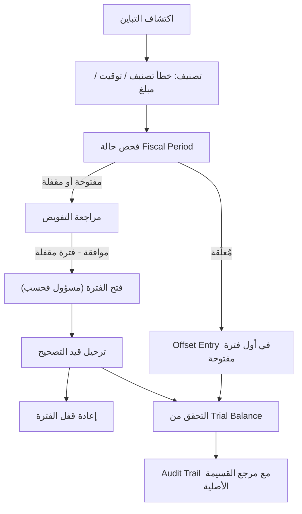

# التباينات المالية بعد الإقفال

## الغرض

يُحدّد هذا الدليل الإجراءات التشغيلية لتحديد التباينات المالية التي تُكتشَف بعد إقفال Fiscal Period (الفترة المحاسبية) وتصنيفها ومعالجتها. يُوجَّه إلى المراقبين الماليين وكبار المحاسبين والمدققين الذين يواجهون أخطاءً في General Ledger (دفتر الأستاذ العام) عقب إقفال الفترة. تسير إجراءات هذا المستند في نطاق مبدأ الثبات المالي (Financial Immutability): سجلات الفترة المُقفَلة دائمة، ويجب تسجيل جميع التصحيحات كمعاملات جديدة في فترة مفتوحة.

## النطاق والتطبيق

يسري هذا المستند على جميع بيئات accore ERP التي جرى فيها Posting (ترحيل) مالي وتقدّمت فيها Fiscal Periods إلى حالة الإقفال أو القفل. يشمل جميع المجالات المالية التي ترحّل معاملاتها في نهاية المطاف إلى General Ledger، من بينها: Commercial (المبيعات) وSupplyChain (المشتريات) وHumanCapital (كشوف الرواتب) وAssets (الاستهلاك). يرتكز على ضوابط المصالحة المحددة في FIN-004 وإجراءات إدارة النقد في FIN-008.

## الإجراء

**تصنيف التباين**

1. عند اكتشاف تباين بعد الإقفال، يُصنّف المراقب المالي النتيجة في إحدى الفئات الثلاث الآتية:
   - **خطأ في التصنيف**: رُحِّلت معاملة في حساب غير صحيح من Chart of Accounts (دليل الحسابات).
   - **فارق توقيت**: رُحِّلت معاملة في الفترة المحاسبية الخاطئة.
   - **مبلغ خاطئ**: القيمة النقدية لـ Journal Entry (القيد اليومي) المُرحَّل غير صحيحة.

2. يتحقق المراقب من حالة Fiscal Period عبر النظام. لا تستقبل الفترات في حالة `closed` أي قيود تصحيحية مهما كان مستوى التفويض. الفترات في حالة `locked` يمكن فتحها من قِبل مسؤول مُفوَّض للتسوية، ثم يجب إعادة قفلها.

**التصحيح عبر قيد المقاصة (Offset Entry)**

3. لجميع الفئات الثلاث، آلية التصحيح هي Offset Entry — قيد Journal Entry جديد ومستقل يُرحَّل في أول Fiscal Period مفتوحة متاحة يعكس أثر الخطأ ويسجّل المعالجة الصحيحة.
4. يُشير Offset Entry إلى رقم القسيمة الأصلية (Voucher Number) في حقل الوصف للحفاظ على قابلية التتبع بين الخطأ وتصحيحه في Audit Trail (سجل التدقيق).
5. تُراجَع المبالغ المصحَّحة مقابل Trial Balance (ميزان المراجعة) المصالَح للتأكيد من أن التسوية تُستعيد التوازن. <!-- [ASSUMPTION] -->

## المراقبة والتحقق

- عقب كل إقفال فترة، ينفّذ الفريق المالي تقرير Trial Balance (ميزان المراجعة) للكشف عن شذوذات أرصدة الحسابات.
- تُنفَّذ مصالحة حسابات النقد والخزينة (وفق إجراءات FIN-008) بوصفها الآلية الرئيسية للكشف عن فوارق التوقيت والمبالغ الخاطئة.
- تُراجَع جميع Offset Entries من قِبل معتمد ثانٍ مُفوَّض قبل الترحيل. <!-- [ASSUMPTION] -->
- يُتفحَّص Audit Trail بعد التصحيح للتأكيد من ظهور القيد الأصلي وقيد المقاصة مع ربطهما برقمَي قسيمتَيهما.

## استرداد الإخفاق

1. إن رُحِّل Offset Entry بمبلغ خاطئ أو في حساب خاطئ، تُطبَّق إجراءات Offset Entry ذاتها تكرارياً — يُرحَّل قيد تصحيح إضافي في فترة مفتوحة يُشير إلى قسيمة التصحيح السابقة. لا تُحذَف أي قيود.
2. إن كان فتح الفترة ضرورياً لكن المسؤول غير متاح، يُوثَّق التباين في سجل الحوادث مع تأثيره المالي المُقدَّر ويُؤجَّل إلى الجلسة التالية للمسؤول المُفوَّض.
3. إن بقي Trial Balance غير متوازن بعد التصحيح، يُصعَّد المراقب المالي الأمر إلى كبير المدققين لإجراء تحقيق مصالحة شامل.

## الامتثال والتدقيق

- يضمن نمط Offset Entry رؤية تاريخ التصحيح الكامل في Audit Trail: يرى المدققون الخطأ الأصلي والتصحيح كسجلَّين منفصلَّين غير قابلَّين للتغيير.
- تُعامَل Fiscal Periods المُقفَلة كسجلات تاريخية دائمة. لا توجد أي آلية في accore ERP تسمح بتعديل أو حذف قيود في فترة مُقفَلة، مما يلبّي متطلبات IFRS وGAAP لقابلية إعادة إنتاج البيانات المالية.
- تُسجَّل جميع أحداث فتح الفترة مع هوية المسؤول المُرخِّص والمبرر التجاري، مما يوفر دليلاً على إدارة الاستثناءات الخاضعة للضبط للمدققين الخارجيين.

## سجل التغييرات

| التاريخ | التغيير | المؤلف |
|---------|---------|--------|
| 2026-03-26 | الإنشاء الأولي — تنفيذ المرحلة الرابعة (ترجمة عربية) | AI (L10N-002) |

## الافتراضات والأسئلة المفتوحة

<!-- [ASSUMPTION] --> مراجعة المعتمد الثاني لـ Offset Entries مُطبَّقة عبر Approval Workflow (سير عمل الموافقة) في النظام؛ يُفترَض أن التهيئة المحددة تتبع نموذج تفويض الترحيل المالي المعياري.
<!-- [ASSUMPTION] --> التحقق من Trial Balance بعد التصحيح يُنفَّذ بواسطة المراقب المالي باستخدام وحدة التقارير في النظام؛ لا يوجد نص تحقق آلي بعد التصحيح في الكود المرصود.
