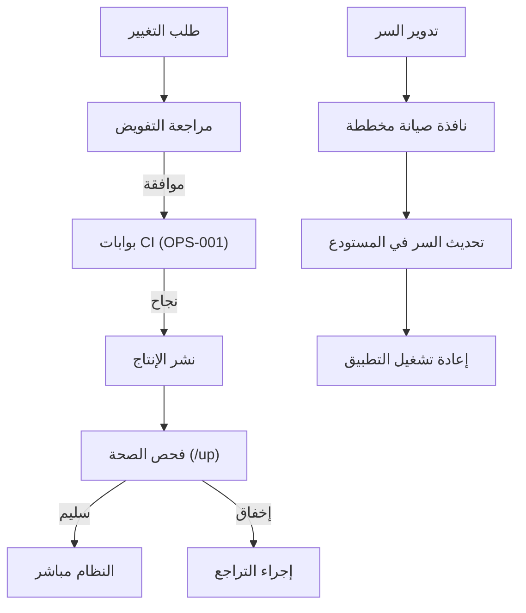

# حوكمة بيئة الإنتاج

## الغرض

يُرسي هذا الدليل إطار الحوكمة لبيئة الإنتاج في ACCSYSTEM ERP. يُحدّد نموذج ضبط الوصول ومتطلبات التفويض للتغييرات وانضباط إدارة الأسرار ومعايير تكافؤ البيئات. يُوجَّه إلى مديري الإصدارات ومهندسي DevOps ومسؤولي الأمان المسؤولين عن الحفاظ على سلامة وتوافر ومراجعية نظام الإنتاج. يُكمّل هذا المستند استراتيجية النشر (OPS-001) بتحديد الضوابط المُطبَّقة على بيئة الإنتاج تحديداً.

## النطاق والتطبيق

يسري هذا المستند على بيئة التشغيل الإنتاجي لـ ACCSYSTEM ERP، الذي يشمل الواجهة الخلفية Laravel PHP والواجهة الأمامية Next.js وقاعدة بيانات PostgreSQL وجميع الأسرار وقيم التهيئة. يلتزم جميع المستخدمين الذين يمتلكون وصولاً إنتاجياً بهذا الإطار.

## الإجراء

**إدارة أسرار البيئة**

1. تُخزَّن جميع قيم التهيئة الحساسة (بيانات اعتماد قاعدة البيانات، ومفاتيح التطبيق، ورموز API، وأسرار التشفير) حصرياً في مستودع الأسرار المُدار بالمنصة وتُحقَن كمتغيرات بيئة في وقت التشغيل. لا يُدرج أي سر في المستودع كنص عادي.
2. يُولَّد `APP_KEY` للواجهة الخلفية Laravel بـ `php artisan key:generate` ويُخزَّن كسر مُدار. تدوير `APP_KEY` يُبطل جميع الحمولات المُشفَّرة والجلسات القائمة؛ يجب الترخيص بذلك من مدير الإصدار وتنفيذه في نافذة صيانة مخططة.
3. بيانات اعتماد قاعدة البيانات (`PGHOST` و`PGPORT` و`PGUSER` و`PGPASSWORD` و`PGDATABASE`) تُحقَن في وقت التشغيل من مستودع الأسرار. يُحظر ترميز بيانات الاعتماد مباشرةً في ملفات التهيئة.
4. يجب تعيين `APP_DEBUG` على `false` في الإنتاج. وضع التصحيح يُفصح عن تفاصيل مسارات الملفات الداخلية والاستعلامات في ردود الأخطاء، مما يُشكّل خطر كشف المعلومات.

**تفويض التغييرات**

5. يجب أن يجتاز كل تغيير مُرقَّى إلى الإنتاج جميع بوابات CI كما حُدِّد في OPS-001.
6. تستلزم التغييرات على مستوى البنية التحتية أو البيئة (تدوير الأسرار، وتهيئة الخادم، وترقيات التبعيات الأمنية) طلب تغيير مكتوباً مُرخَّصاً من القائد التقني وموثقاً في سجل الحوادث قبل التنفيذ. <!-- [ASSUMPTION] -->
7. الإصلاحات الطارئة التي تتجاوز عملية طلب السحب المعيارية تستلزم مراجعة لاحقة خلال 24 ساعة وتوثيقاً كاملاً للتغيير والمبرر والأثر.

## المراقبة والتحقق

- تُتحقَّق من صحة التطبيق باستمرار عبر نقطة نهاية `/up` التي يُوفّرها Laravel.
- يجمع تجميع السجلات مخرجات سجل تطبيق Laravel؛ يُعيَّن `LOG_LEVEL` على `error` في الإنتاج. <!-- [ASSUMPTION] -->
- تُراجَع أحداث الوصول غير المُخوَّل وإخفاقات المصادقة من جدول `login_attempts` أسبوعياً.
- يُتحقَّق من سلامة متغيرات البيئة (تأكيد `APP_DEBUG=false` و`APP_ENV=production`) عند كل نشر. <!-- [ASSUMPTION] -->

## استرداد الإخفاق

1. عند إفضاء نشر إنتاجي إلى حالة غير سليمة، ينفّذ مهندس الإصدار التراجع إلى إدراج `main` السابق. هدف وقت الاسترداد 30 دقيقة. <!-- [ASSUMPTION] -->
2. عند الاشتباه في اختراق سر، يُدار السر فوراً في مستودع المنصة ويُعاد تشغيل التطبيق. يُسجَّل تقرير حادثة أمنية.
3. إن اكتُشف `APP_DEBUG=true` في الإنتاج، يُصحَّح متغير البيئة فوراً دون طلب تغيير رسمي، ويُسجَّل الحدث في سجل الحوادث الأمنية.

## الامتثال والتدقيق

- تقييد وضع التصحيح في الإنتاج يحمي من الكشف غير المقصود عن البيانات المالية أو بيانات الاعتماد في ردود الأخطاء.
- إدارة الأسرار عبر مستودع المنصة تضمن عدم كشف بيانات الاعتماد في سجل إدارة الإصدارات، مما يدعم امتثال SOC 2 CC6.
- متطلب التفويض لجميع التغييرات الإنتاجية يُنتج مساراً لأدلة التدقيق صالحاً للمراجعة الداخلية والرقابة التنظيمية الخارجية.

## سجل التغييرات

| التاريخ | التغيير | المؤلف |
|---------|---------|--------|
| 2026-03-26 | الإنشاء الأولي — تنفيذ المرحلة الرابعة (ترجمة عربية) | AI (L10N-002) |

## الافتراضات والأسئلة المفتوحة

<!-- [ASSUMPTION] --> تفويض طلب التغيير للبنية التحتية يُنفَّذ عبر عملية داخلية (نظام تذاكر أو موافقة مكتوبة) غير محددة في المستودع.
<!-- [ASSUMPTION] --> تجميع السجلات على مستوى الإنتاج مُقدَّم من منصة الاستضافة أو خدمة إدارة سجلات خارجية.
<!-- [ASSUMPTION] --> هدف وقت الاسترداد 30 دقيقة افتراض عمل يستند إلى أهداف توافر ERP المؤسسية المعتادة ولم يُحدَّد رسمياً في الكود المرصود.
