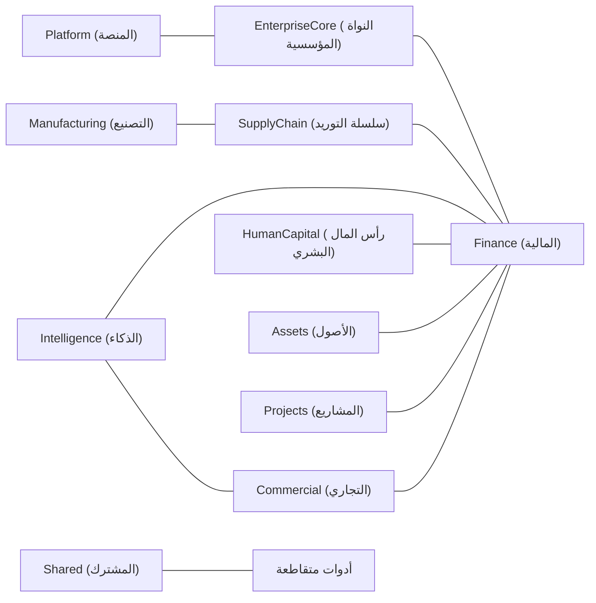

# خريطة السياقات المحدودة

## الملخص التنفيذي

تُحدّد خريطة السياقات المحدودة (Bounded Context Map) كيفية تقسيم ACCSYSTEM ERP قدراتِه التجارية إلى مجالات (Domains) مستقلة، يمتلك كل منها نموذجه ولغته ومسؤوليته الخاصة. تحول هذه البنية دون التداخل المفاهيمي بين العمليات المالية والتجارية والتشغيلية ورأس المال البشري. وتُمثّل المرجعَ الموثوق لفهم حدود المسؤوليات عبر المنصة.

## المبرر التجاري

تتعثر منظومات ERP المؤسسية حين تحاول وحداتٌ متعددة امتلاك المفاهيم ذاتها، أو حين تتشابك الشواغل المالية والتشغيلية دون حدود واضحة. يعتمد ACCSYSTEM ERP نهج السياق المحدود (Bounded Context) لمنح كل مجال نطاقاً محدداً، مما يُتيح للفرق تطوير القدرات بصورة مستقلة مع الحفاظ على التماسك الكلي للنظام.

يدعم هذا الفصل التوقعات التنظيمية المتعلقة بالدقة المالية وقابلية التتبع والمساءلة. يستطيع مجال Finance (المالية) تطبيق الثبات المالي وانضباط Audit Trail (سجل التدقيق) دون ارتباط مباشر بسير العمل الموجّه للمستخدم، بينما تحافظ المجالات الأخرى على تركيزها في دورات حياتها التشغيلية.

## المبادئ الجوهرية

1. **ملكية واحدة لكل قدرة تجارية** — تنتمي كل قدرة رئيسية، كـ General Ledger (دفتر الأستاذ العام) أو إدارة القوى العاملة، إلى مجال واحد تحديداً.
2. **بنية المجال الفرعي الصريحة** — تُنظَّم المجالات داخلياً في Subdomains (مجالات فرعية) تجمع القدرات ذات الصلة خلف مفردات موحّدة.
3. **عزل المجال** — لا تتقاطع قواعد الأعمال ونماذج البيانات عبر حدود المجالات مباشرةً؛ ويتم التكامل عبر نقاط تكامل محددة.
4. **لغة خاصة بكل سياق** — يستخدم كل مجال مصطلحات مُصمَّمة لمسؤولياته، مع توافقها مع القاموس المشترك (Glossary) للمفاهيم المؤسسية العامة.
5. **جوهر ثابت، حواف قابلة للتوسع** — تبقى المجالات الجوهرية كـ EnterpriseCore (النواة المؤسسية) وFinance (المالية) ثوابت راسخة، بينما يمكن لمجالات كـ Manufacturing (التصنيع) وProjects (المشاريع) وIntelligence (الذكاء) التوسع بمرور الوقت.

## التعبير المعماري

يُعيّن هيكل ACCSYSTEM ERP 11 سياقاً محدوداً مباشرةً إلى مجلدات `backend/app/Domains`، عاكساً القائمة الموثوقة في محرك التوثيق. تمثل المجالات الفرعية داخل كل مجال شرائح سلوكية مركّزة.

تقتصر تفاعلات المجالات على مسارات تكامل مقصودة: تدفع Commercial (التجارية) وSupplyChain (سلسلة التوريد) أحداثاً تشغيلية تنتهي بالترحيل في Finance (المالية)؛ يُغذّي HumanCapital (رأس المال البشري) نتائج مالية وإبلاغية؛ وتوفّر EnterpriseCore (النواة المؤسسية) وPlatform (المنصة) قدرات مشتركة كالهوية والحوكمة والتكامل.

## الأثر على المجالات

- **EnterpriseCore (النواة المؤسسية)** تحكم المخاوف المتقاطعة كالهوية والحوكمة والهيكل التنظيمي دون امتلاك دورات الحياة المالية أو التشغيلية.
- **Finance (المالية)** تمتلك General Ledger (دفتر الأستاذ العام) والمحاسبة الإدارية والمجالات الفرعية ذات الصلة، وهي نظام السجل للترحيلات المالية.
- **Commercial (التجاري)** يمتلك المبيعات وCRM (إدارة علاقات العملاء) ونشأة الإيرادات، بينما تمتلك **SupplyChain (سلسلة التوريد)** دورات حياة المشتريات والمخزون.
- **HumanCapital (رأس المال البشري)** يحكم إدارة القوى العاملة وكشوف الرواتب والخدمات ذات الصلة التي تُنشئ أحداثاً ذات دلالة مالية.
- **Assets (الأصول) وManufacturing (التصنيع) وProjects (المشاريع)** تُشكّل مجالات متخصصة لدورة حياة الأصول وضبط الإنتاج وتنفيذ المشاريع.

## التوافق مع الصناعة

تتوافق خريطة السياقات المحدودة هذه مع مبادئ هيكلة ERP الشائعة في المؤسسات الكبرى، حيث تمثّل المالية وسلسلة التوريد ورأس المال البشري والمشاريع محاور وظيفية رئيسية. يتسق التأكيد على Finance (المالية) بوصفها نظام سجل غير قابل للعكس مع توقعات المدققين والجهات التنظيمية والمهندسين المعماريين.

## الافتراضات والأسئلة المفتوحة

- <!-- [ASSUMPTION] --> تُرسل المجالات التشغيلية أحداث تكامل (Integration Events) تؤثر مالياً في Finance، حتى حيثما لم يُطبَّق هذا بالكامل في الكود حالياً.
- <!-- [ASSUMPTION] --> يُتوقَّع من Intelligence وPlatform التكامل مع جميع المجالات ذات الصلة عبر أحداث التكامل المعيارية والأدوات المتقاطعة.
