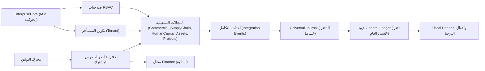

# الافتراضات التجارية الجوهرية

## الملخص التنفيذي

تُحدّد الافتراضات التجارية الجوهرية الحقائق غير القابلة للتفاوض التي يُلزم ACCSYSTEM ERP كل مجال (Domain) باحترامها. وهي تصف كيفية التعامل مع الدقة المالية، وضبط الوصول، والمستأجرية المتعددة (Multi-Tenancy)، وملكية البيانات عبر المنصة، وتُشكّل قاعدة ثابتة للقرارات المستقبلية.

## المبرر التجاري

تعمل أنظمة ERP المؤسسية في بيئات خاضعة للتنظيم، حيث تترتب على أخطاء الترحيلات المالية أو ضبط الوصول أو عزل المستأجر عواقب جوهرية. لذا يعتمد ACCSYSTEM ERP افتراضات صريحة على المستوى التجاري تُقلّل الغموض للمهندسين المعماريين والمطورين والمدققين. يضمن توحيد مفاهيم كـ Double-Entry Bookkeeping (المحاسبة ذات القيد المزدوج) والثبات المالي وMulti-Tenancy وRBAC (ضبط الوصول المستند إلى الأدوار) أن القدرات الجديدة تُعزّز إطار الضبط لا تُضعفه.

## المبادئ الجوهرية

1. **المحاسبة ذات القيد المزدوج (Double-Entry Bookkeeping) شاملة** — كل نشاط ذو دلالة مالية يُرحَّل في نهاية المطاف كقيود Journal Entries (قيود يومية) متوازنة في General Ledger (دفتر الأستاذ العام).
2. **الثبات المالي (Financial Immutability) إلزامي** — بعد حدوث Posting (الترحيل) في دفتر الأستاذ العام، تُعامَل السجلات كثابتة، وتُجرى التصحيحات بواسطة Offset Entries (قيود المقاصة) وقسائم التسوية. <!-- [ASSUMPTION] -->
3. **Universal Journal (الدفتر الشامل) العمود الفقري المالي الوحيد** — يوفر Universal Journal رؤيةً ماليةً موحدةً عبر المجالات، إذ تجمع قيمة voucher_number (رقم القسيمة) قيودَ Journal Entries المنتمية إلى حدث اقتصادي واحد.
4. **RBAC (ضبط الوصول المستند إلى الأدوار) النموذج الوحيد للتفويض** — يحكم RBAC صلاحيات المستخدمين في بدء الأنشطة التجارية أو الموافقة عليها أو ترحيلها أو عكسها؛ وتُسنَد الصلاحيات للأدوار لا للأفراد.
5. **Multi-Tenancy (المستأجرية المتعددة) مع عزل صارم** — يُعزَل كل Tenant (مستأجر) بحيث لا تتسرب Master Data (البيانات الرئيسية) والمعاملات والتكوين من مؤسسة إلى أخرى.
6. **ملكية البيانات على مستوى المجال** — يمتلك كل مجال كياناته الجوهرية وبياناته الرئيسية؛ وتُنسَّق التفاعلات المتقاطعة عبر Integration Events (أحداث التكامل). <!-- [ASSUMPTION] -->
7. **حوكمة دورة الحياة للوثائق** — تتبع الوثائق التجارية الرئيسية دورات حياة (Lifecycles) صريحة بحالات وانتقالات محددة، تشمل الترحيل والإقفال.
8. **التوثيق والكود يتشاركان حقيقة واحدة** — يُنقَّح التوثيق في المستودع ذاته مع التطبيق ويُعامَل كجزء من سطح الضبط.

## التعبير المعماري

تنعكس هذه الافتراضات في نماذج GeneralLedger وUniversalJournal في مجال Finance (المالية)، التي توحّد الترحيلات المالية وتضمن أن كل معاملة تتكون من قيود Journal Entries متوازنة. تُعزّز مفاهيم Posting وFiscal Periods والفترات المقفلة أن التاريخ المالي لا يُعدَّل باستهتار.

## الأثر على المجالات

- **Finance (المالية)** يجب أن تُطبّق Posting وDouble-Entry Bookkeeping وإقفال Fiscal Period وUniversal Journal بوصفه المستودع الاحترافي للحقيقة المالية.
- **المجالات التشغيلية** كـ Commercial وSupplyChain وHumanCapital وAssets وProjects تُولّد أحداثاً تصبح ترحيلات مالية؛ يجب أن يحترم تصميمها أن التأثير المالي النهائي يتحدد في Finance.
- **EnterpriseCore وPlatform** تُطبّقان RBAC وتكوين Tenant وأتمتة وخدمات تكامل تعتمد عليها جميع المجالات.

## التوافق مع الصناعة

تتوافق هذه الافتراضات مع توقعات ERP المعيارية التي تتطلب ماليات جاهزة للتدقيق، وأنماطاً متسقة للترحيل والعكس، وعزل المستأجر، ودورات حياة قابلة للتتبع للوثائق الرئيسية.

## الافتراضات والأسئلة المفتوحة

- <!-- [ASSUMPTION] --> تُمثَّل جميع تصحيحات السجلات المالية المُرحَّلة كـ Offset Entries أو قسائم تسوية، وليس بتعديل مباشر في جداول General Ledger.
- <!-- [ASSUMPTION] --> ملكية البيانات المتقاطعة بين المجالات مُطبَّقة بتمرير Integration Events والمعرّفات بدلاً من مشاركة الجداول القابلة للتعديل.
- <!-- [ASSUMPTION] --> تُرحَّل التأثيرات المالية للمجالات التشغيلية عبر Universal Journal وGeneral Ledger في مجال Finance.
