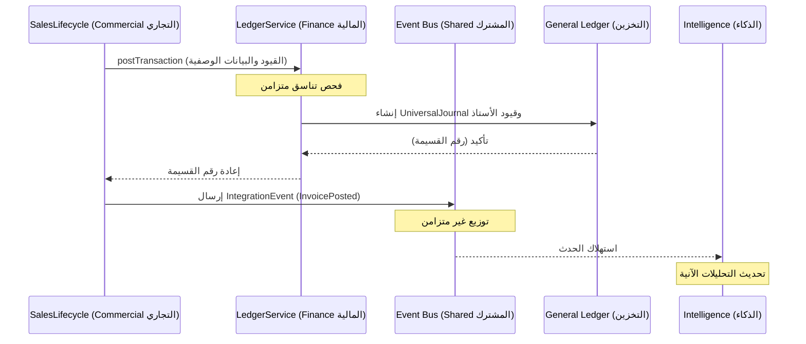

# أنماط التكامل المتقاطع بين المجالات

## السياق التجاري

في ERP المؤسسي، لا يعمل أي مجال (Domain) بمعزل عن غيره. تترتب على عملية بيع في مجال Commercial (التجاري) تبعات مالية فورية وغير قابلة للعكس في مجال Finance (المالية). كذلك تؤثر حركات المخزون في SupplyChain (سلسلة التوريد) على أصول الميزانية العمومية وتكلفة البضاعة المباعة (COGS).

للحفاظ على سلامة خريطة السياقات المحدودة (Bounded Context Map)، يُطبّق ACCSYSTEM أنماطاً صارمة لكيفية تواصل هذه المجالات، مما يمنع بنى "كرة الطين الكبرى" حيث تعتمد كل وحدة على تفاصيل داخلية من وحدة أخرى.

## البنى المعمارية للتكامل

### 1. التفويض المتزامن للخدمة (النواة المالية)

للعمليات التي تستلزم تناسقاً فورياً — ولا سيما ترحيلات General Ledger (دفتر الأستاذ العام) — تتفاعل المجالات التشغيلية (المبيعات والمشتريات وكشوف الرواتب) مع مجال Finance (المالية) عبر نمط "التفويض للخدمة". يضمن هذا إدراج الوثيقة التشغيلية (كـ Sales Invoice) وانعكاسها المالي (قسيمة دفتر الأستاذ) كوحدة عمل ذرية.

### 2. الفصل المبني على الأحداث (الامتدادات التشغيلية)

للتأثيرات اللاحقة غير الحرجة — كتحديث سجل تدقيق أو تشغيل إشعار أو تحديث لوحة بيانات — تُرسل المجالات **Integration Events (أحداث التكامل)**. تُتيح هذه الأحداث للمجال الناشر أن يبقى جاهلاً بمشتركيه، مما يُيسّر بنية ERP قابلة للتوسع.

## نمط عقد الحدث

يجب أن تتبع جميع Integration Events في ACCSYSTEM عقداً مفاهيمياً موحداً:

| الحقل | النوع | الدلالة التجارية |
|-------|-------|-----------------|
| `event_id` | UUID | معرّف فريد لتتبع Idempotency (اللاتكرارية). |
| `timestamp` | ISO8601 | وقت وقوع الحدث التجاري في وقت المصدر. |
| `publisher_domain` | String | السياق المحدود (Bounded Context) المنشئ للحدث. |
| `event_type` | String | الاسم التصنيفي (مثلاً: `Sales.Invoice.Posted`). |
| `payload` | Object | DTO (كائن نقل البيانات) مختصر يحتوي المعرّفات والحالة الثابتة. |
| `context` | Object | بيانات وصفية تشمل `user_id` و`tenant_id`. |

## مخطط التسلسل: تكامل المبيعات مع دفتر الأستاذ

## شروط الإطلاق

تُطلَق Integration Events فحسب عند **الإدراج الناجح** لعملية مُغيِّرة للحالة.
- **الإطلاق التلقائي**: تُرسَل الأحداث في ختام عملية Action (إجراء) أو Service (خدمة) آمنة.
- **الإطلاق المؤجل**: في سيناريوهات الحجم الكبير، يمكن استمرار الأحداث في جدول Outbox وإرسالها بواسطة عامل خلفي لمنع فشل التكامل من تعطيل التدفق الرئيسي للأعمال. <!-- [ASSUMPTION] -->

## سلوك المشتركين

يجب على مشتركي أحداث تكامل ERP الالتزام بقيدين أساسيين:
1. **اللاتكرارية (Idempotency)**: إذ قد تُعاد أحداث التكامل بسبب إخفاقات الشبكة، يتحقق المشترك من معالجة `event_id` مسبقاً قبل اتخاذ أي إجراء.
2. **سلامة القراءة فقط**: لا يحق للمشترك تعديل الكيانات المصدر الواردة في الحمولة؛ أي تغيير مشتق يُسجَّل في السياق المحدود الخاص بالمشترك.

## استراتيجية الإخفاق وإعادة المحاولة

يُسبّب إخفاق نقطة تكامل متزامنة (كـ LedgerService الرافض) تراجعاً كاملاً للمعاملة الأم، لضمان عدم وجود بيانات في حالة تكامل جزئي. في المقابل، تُعالَج إخفاقات مشتركي Integration Events غير المتزامنين عبر آلية إعادة محاولة مركزية بأسلوب التراجع الأسي، تُتتبَّع في مجال MonitoringCompliance (مراقبة الامتثال). <!-- [ASSUMPTION] -->

## الافتراضات والأسئلة المفتوحة

1. **[ASSUMPTION]**: يُفترَض أن سير العمل المتقاطع الأكثر تعقيداً (كـ Manufacturing إلى Inventory) سيعتمد نمط Integration Events غير المتزامن.
2. **[ASSUMPTION]**: يُفترَض توحيد Outbox Pattern أو طابور رسائل موثوق عبر المنصة لجميع أحداث التكامل غير الحرجة.
3. **سؤال مفتوح**: هل يجب أن يُرسل UniversalJournal أحداثاً (مثلاً: `GL.Entry.Posted`) للاستهلاك من قِبل جميع المجالات؟
