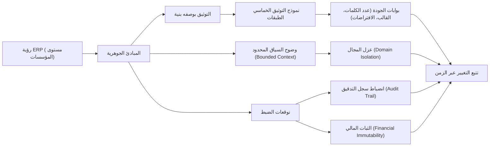

# فلسفة ورؤية نظام ERP

## الملخص التنفيذي

يُعدّ ACCSYSTEM ERP منصةً متكاملة على مستوى المؤسسات، مصمَّمةً لتوحيد الوظائف التجارية الأساسية تحت نموذج حوكمة موحّد. تُولي فلسفة النظام أولوية قصوى لسلامة التدقيق، والدقة المالية، وانضباط التوثيق باعتبارها ضوابط مؤسسية من الدرجة الأولى. وتُجسّد هذه الفلسفة قاعدةً راسخةً لنظام ERP (تخطيط موارد المؤسسات) قادرةً على التوسع من التنفيذ التشغيلي إلى إعداد التقارير الخاضعة للامتثال، دون الاعتماد على سلوكيات مبهمة.

## المبرر التجاري

تحتاج المؤسسات الكبرى إلى أكثر من مجرد تغطية وظيفية؛ إذ تحتاج إلى ضوابط يمكن التنبؤ بها، وقابلية للتتبع، ونموذج موحد للحقيقة عبر جميع الوظائف. جاء ACCSYSTEM ERP لسد الفجوة بين الأنظمة التشغيلية اليومية وتوقعات الحوكمة الخاصة بالإدارة المالية، والمدققين، والقيادة العليا، من خلال معاملة سلامة المعاملات والمساءلة والتوثيق بوصفها ثوابت غير قابلة للتفاوض.

يهدف النظام استراتيجياً إلى تقديم مستوى ERP مماثل لـ SAP مع الحفاظ على إمكانية الوصول للمؤسسات التي تحتاج إلى انضباط ERP حديث دون الارتباط بمورد محدد. يتجلى هذا التوجه في الالتزام بالتتبع الشامل عبر Audit Trail (سجل التدقيق)، وحوكمة دورة حياة الوثائق التجارية المدروسة، ونظام توثيق مُصمَّم للحفاظ على دقته مع تطور المنتج.

## المبادئ الجوهرية

1. **حقيقة مؤسسية موحّدة** — تتقاطع الأنشطة التشغيلية والنتائج المالية في سجل مؤسسي متسق وصالح للرقابة والإبلاغ.
2. **سلامة التدقيق بالتصميم** — تتتبع الأنشطة التجارية عبر Audit Trail (سجل التدقيق) غير القابل للتغيير، الذي يدعم التحقيق والمساءلة والتوقعات التنظيمية.
3. **الثبات المالي** — تُعامَل السجلات المالية المُرحَّلة باعتبارها ثابتة؛ وتُجرى التصحيحات عبر أنماط Offset Entry (قيود المقاصة) بدلاً من التعديل المباشر الصامت.
4. **التوثيق بوصفه بنية** — يُحتفظ بالتوثيق كأصل نظام محكوم، مُنقَّح مع التطبيق، وخاضع لبوابات الجودة.
5. **وضوح السياق المحدود** — يُنظَّم النظام حول حدود Bounded Context (السياق المحدود) لمنع الانجراف المفاهيمي وتقليل الغموض الوظيفي المتقاطع.
6. **الانضباط المنسجم مع الصناعة** — تتوافق المصطلحات والضوابط وحوكمة دورة الحياة مع توقعات ERP الراسخة للدقة المالية والمساءلة التشغيلية.

## التعبير المعماري

تتجلى الفلسفة في محرك توثيق مُتحكَّم فيه، وتصنيف توثيق متعدد الطبقات، وحوكمة المصطلحات التي تُثبّت المعنى عبر الفرق. يُولِّد هذا حلقةً تغذية مؤسسية راجعة: تُحدّد المبادئ التجارية القيود، وتُشكّل القيود بنية النظام، ويُطبّق التوثيق الاتساق عبر الزمن.

## الأثر على المجالات

تُقيّد هذه الفلسفة وتُمكّن سلوك المجال عبر ERP:

- **Finance (المالية)**: تستلزم ترحيلات مالية وإعداد تقارير تتطلب الثبات وسجل تدقيق قابل للدفاع، داعمةً Double-Entry Bookkeeping (المحاسبة ذات القيد المزدوج) والتصحيح عبر Offset Entry (قيد المقاصة).
- **Commercial (التجاري) وSupplyChain (سلسلة التوريد)**: تُتوقَّع قابلية تتبع المعاملات التشغيلية إلى نتائج ذات صلة مالية، مع الحفاظ على المساءلة عبر دورات حياة الوثائق.
- **HumanCapital (رأس المال البشري) وProjects (المشاريع)**: تستلزم أنشطة القوى العاملة والمشاريع Master Data (البيانات الرئيسية) متسقة ودورات حياة مُتحكَّماً فيها للحفاظ على سلامة التقارير.
- **Platform (المنصة) وShared (المشترك)**: يوجد اتساق المصطلحات وأتمتة الحوكمة والمعايير المتقاطعة للحد من الغموض والحفاظ على تماسك النظام.

## التوافق مع الصناعة

تُركّز معايير ERP المؤسسية على قابلية التكرار، وأدلة الضبط، والمصطلحات الموحدة عبر المجالات الوظيفية. يتوافق ACCSYSTEM ERP مع هذه التوقعات بتمركزه حول قابلية التدقيق، ودورات حياة الوثائق المنضبطة، ومبدأ أن السجلات المالية المُرحَّلة ثابتة.

## الافتراضات والأسئلة المفتوحة

- لا توجد افتراضات محددة من المصادر المعتمدة لهذه المهمة.
