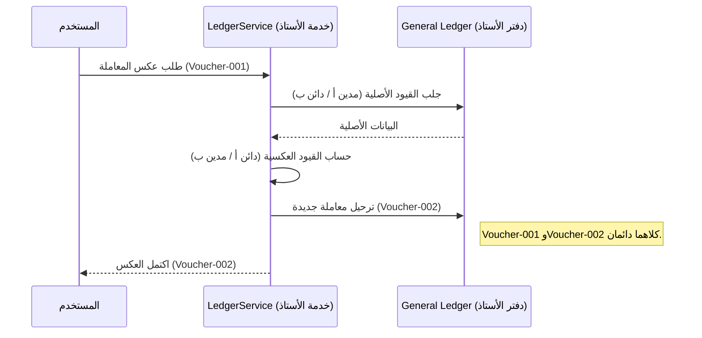

# ثبات البيانات المالية

## المبرر التجاري

تُعدّ سلامة General Ledger (دفتر الأستاذ العام) الركيزةَ الأساسية لأي نظام ERP (تخطيط موارد المؤسسات). في المحاسبة المالية، إمكانية تعديل السجلات التاريخية أو حذفها تُمثّل خطراً كارثياً يُقوّض سجلات التدقيق، ويُيسّر الاحتيال، ويخالف المعايير المحاسبية الدولية كـ IFRS وGAAP.

يضمن مبدأ ثبات البيانات المالية (Financial Immutability) أنه بعد اكتمال المعاملة — المعروفة بـ Posting (الترحيل) — تصبح جزءاً دائماً من السجل الاقتصادي للمؤسسة. يصون هذا القيد النظام من التلاعب بأثر رجعي، ويضمن قابلية إعادة إنتاج التقارير المالية (الميزانية، وقائمة الأرباح والخسائر)، ويوفر للمدققين الخارجيين سجلاً موثوقاً لكل حدث ذي قيمة.

## تعريف القيد

يتحدد قيد الثبات (Immutability Constraint) بالقواعد الآتية:

1. **ثبات ما بعد الإدراج**: بعد إدراج رأس UniversalJournal (الدفتر الشامل) وقيود GeneralLedger (دفتر الأستاذ) المرتبطة به بحالة `posted`، لا يجوز تعديلها أو حذفها عبر واجهات التطبيق المعيارية أو العمليات القاعدية.
2. **تسلسل رقمي متواصل**: يجب أن تتبع أرقام القسائم (Voucher Numbers) المُسنَدة للمعاملات تسلسلاً خالياً من الفجوات، ولا يجوز إعادة استخدامها حتى عند إلغاء معاملة.
3. **الحدود الزمنية**: يجب أن تجري جميع العمليات المالية ضمن FiscalPeriod (الفترة المحاسبية) المفتوحة. بعد أن تصبح الفترة "مقفلة" أو "مُغلَقة"، لا يجوز إدراج أي قيد — بما فيها التصحيحات — في ذلك النطاق الزمني.
4. **التصحيح عبر المقاصة**: يجب تصحيح أي خطأ في معاملة مُرحَّلة بمعاملة جديدة ومستقلة (قيد عكسي أو تسوية) في فترة محاسبية نشطة.

## الكيانات والعمليات المتأثرة

الكيانات الخاضعة لقيد الثبات:

- **UniversalJournal**: رأس المعاملة المحتوي على رقم القسيمة وملخص الوثيقة.
- **GeneralLedger**: البنود الفردية (المدينات والدائنات) المكوِّنة للقيد المزدوج.
- **FiscalPeriod**: المتحكم الزمني الذي يحدد صلاحية تواريخ المعاملات.

**العمليات المُطبِّقة للقيد**:
- **PostTransaction**: تتحقق من تفرد رقم القسيمة وأن الفترة المحاسبية المستهدفة مفتوحة.
- **ReverseTransaction**: تُولّد قيوداً عكسية جديدة بدلاً من تعديل القيود القائمة.
- **CloseFiscalPeriod**: تُنهي جميع القيود ضمن نطاق تاريخي وتمنع مزيداً من الترحيل.

## آلية التطبيق

يُطبَّق القيد في **طبقة منطق التطبيق** لضمان احترام قواعد الأعمال قبل أي تفاعل مع القاعدة.

1. **التحقق المبني على الحالة**: يعمل `LedgerService` (خدمة دفتر الأستاذ) حارساً رئيسياً. قبل كتابة أي قيد في جدول GeneralLedger، تتحقق الخدمة من حالة FiscalPeriod المرتبطة بتاريخ المعاملة.
2. **الثبات على مستوى الخدمة**: لا توجد أساليب `update` أو `delete` ضمن `LedgerService` لقيود الأستاذ المُرحَّلة. تدعم بنية النظام عمليتَي الإنشاء (الترحيل) والقراءة (الإبلاغ) فحسب.
3. **ضبط النموذج**: نموذج GeneralLedger مُهيَّأ بما يُشير إلى طبيعته الثابتة. <!-- [ASSUMPTION] -->

## الامتثال والتدقيق

يُعدّ هذا القيد الآلية الأساسية للامتثال لـ SOC 1/SOC 2 والتدقيق المالي القانوني. يضمن حظر الحذف إمكانية تتبع كل مبلغ من مصدره — كـ Sales Invoice (فاتورة المبيعات) — إلى موقعه النهائي في Chart of Accounts (دليل الحسابات).

## الحالات الطرفية

- **المعاملات المسودة**: المعاملات في حالة "مسودة" لا تخضع لهذا القيد حتى تُرحَّل رسمياً في دفتر الأستاذ.
- **إعادة فتح الفترة**: في الظروف الاستثنائية، يجوز لمسؤول مُفوَّض "فتح" فترة مقفلة لإتاحة تسوية متأخرة. غير أنه بعد "الإغلاق النهائي" للفترة، تصبح ثابتة نهائياً.

## الافتراضات والأسئلة المفتوحة

1. **[ASSUMPTION]**: يُفترَض أنه سيُستخدَم مستقبلاً ضبط قاعدة البيانات (GRANT/REVOKE) لتقييد صلاحيات `UPDATE` و`DELETE` على جدول `general_ledger`.
2. **[ASSUMPTION]**: يُفترَض أن مسودات القيود محفوظة في جداول منفصلة حتى لا تتداخل مع الأستاذ الثابت.
3. **سؤال مفتوح**: هل يستلزم النظام قفلاً صلباً على مستوى القاعدة (عبر Triggers) لمنع حتى التدخلات اليدوية من مسؤولي قواعد البيانات؟
